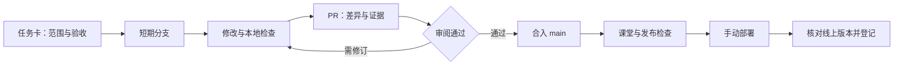

# GitHub 协作流程设计

2026-09-21｜针对教师、助教与 AI 助手的小型课程团队｜本地规范草案

## 1. 采用什么协作模式

建议采用 **GitHub Flow：main + 短期任务分支 + PR 审阅**。main 存放已合并的可交付源码；课堂正式版由发布记录标识。合并与上线分为两步，以便在网站变化前完成投屏、双屏和离线检查。

GitHub 官方将 GitHub Flow 定义为轻量分支流程，并通过 PR 保留审阅和修改记录。[官方流程](https://docs.github.com/en/get-started/using-github/github-flow)

| 模式 | 典型组织方式 | 对本项目的取舍 |
|---|---|---|
| GitHub Flow | 主线、短分支、PR | 推荐：与每周课程和小团队的任务规模匹配 |
| Gitflow | main、develop、功能及发布分支 | 暂不采用：目前没有多条长期维护的产品版本线，分支同步成本偏高 |
| 主干开发 | 很短的分支、频繁集成、较强自动化 | 可借鉴小批量修改；当前还需人工内容与课堂检查 |
| Fork + PR | 在个人分叉中修改，再向原仓库提议 | 适用于未来没有仓库写权限的外部贡献者 |

上述取舍是针对本课程的设计判断。Atlassian 的 Gitflow 文档也指出，这套流程对持续集成存在额外复杂性；并非本课程必须仿照的软件开发标准。[Atlassian Gitflow 说明](https://www.atlassian.com/git/tutorials/comparing-workflows/gitflow-workflow/)

## 2. 谁负责什么

| 角色 | 主要责任 | 交付判断 |
|---|---|---|
| 教师 | 学习目标、知识层次、史学表述、案例取舍与课堂时间 | 内容可以讲、结论有边界 |
| 助教／技术维护者 | 来源整理、组件实现、依赖、构建、设备检查 | 功能与记录相符，普通设备可使用 |
| AI 助手 | 在授权范围内检索、起草、实现、检查和汇报 | 明示依据、改动、实际验证与缺口 |
| 发布人 | 汇总验收、核对产物、上线、记录及恢复 | 线上版本可对应到确切提交 |

一个人可以兼任多个角色，但应分别填写内容判断与技术结果。AI 审读是辅助记录；需要独立复核时记录实际审阅人、对象和日期。账号和权限尚未核定，因此本轮没有写入生效的 CODEOWNERS，也未自动请求任何人审阅。

## 3. 每项任务怎样流转



建议任务状态：待讨论 → 可开始 → 进行中 → 待审阅 → 可合并 → 待发布 → 已发布。纯文档任务可在“可合并”之后标完成，不必经过网站发布。

“已写好”“构建成功”“课堂验证”“已上线”分别记录。不能因为页面文件存在就把任务标为可授课，也不能用是否合并代替部署状态。

每项课件任务同时记录：概念编号（如 N03）、页面稳定 ID、来源 ID、执行模式、内容状态和测试记录。章节重排时保留旧新编号对应，避免教案、网页与课后任务各用一套定义。

## 4. 仓库如何组织

采用按周独立工程，沿用助教 Stencil 结构，不在第一次导入时同时重构为共享组件系统。建议结构如下；标“规划”的目录本轮没有创建。

```text
pku-aihis/
├── README.md / AGENTS.md / CONTRIBUTING.md
├── .github/
│   ├── ISSUE_TEMPLATE/course_task.yml
│   └── pull_request_template.md
├── docs/                         # 规范、来源索引、决定及发布记录
├── apps/                         # 规划
│   └── week03/                   # 助教工程导入位置
│       ├── package.json / pnpm-lock.yaml
│       ├── stencil.config.ts / tsconfig.json
│       ├── src/                  # 页面、组件、允许公开的小型数据
│       └── tests/                # 按实际需要增补
├── scripts/                      # 规划：全站产物组装、检查
└── site/                         # 规划：生成的全站发布产物，不提交
```

每周先保留自己的锁文件和构建配置。出现经过两周以上验证的公共组件后，再单独讨论抽取共享包；避免在课程制作前增加不必要的工程迁移。

公开来源索引应包含 `source_id`、题名、版本、页码／定位、公开链接、转录／核验状态、使用范围、散列（如适用）。正文原页、工作转录、检索副本和模型摘要分别标识；技术参数另记模型名与版本、预处理、维度和生成日期。

备课母稿仍以课程文件夹中的 Markdown 为编辑主稿，Word/PDF 为同步版本。未来确需发布学生阅读版时，从明确版本导出，不在仓库内再养一份内容分叉的母稿。

## 5. 审阅和主线规则

完成首次提交之后，建议配置 main：通过 PR 合入、至少一名非作者审批、解决讨论后合并、更新后重新审阅关键改动、禁止强制推送与删除。先运行实际 CI，再把已出现且名称稳定的检查设为必需，不能填入尚不存在的检查名造成所有 PR 等待。

上述平台能力由分支保护或 ruleset 实现；本轮没有改变远端设置。[GitHub 分支保护说明](https://docs.github.com/en/repositories/configuring-branches-and-merges-in-your-repository/managing-protected-branches/about-protected-branches)

内容审阅核对史料定位、概念表述和教学任务；技术审阅核对实际模式、运行步骤和失败行为。跨两类的 PR 同时登记两类结果。普通措辞修订只做相关审读，无须机械地要求所有角色重复检查。

CODEOWNERS 可以按目录分派负责者，但同一路径列两个人并不等于两个人都必须批准。教师与助教的两类验收应保存在 PR 记录中，不能把这项要求寄托于名单本身。[GitHub CODEOWNERS 说明](https://docs.github.com/en/repositories/managing-your-repositorys-settings-and-features/customizing-your-repository/about-code-owners)

只有一名有效维护者时，先保留 PR 和书面审阅记录，不设置其无法满足的自我审批要求；加入第二位具有适当权限的维护者后再启用对应强制规则。

## 6. 分阶段落地

| 阶段 | 产出和退出条件 | 当前状态 |
|---|---|---|
| P0 流程准备 | 基线、skill、规范、任务和审阅模板 | 本轮完成本地准备，待入库 |
| P1 首次入库 | 最小初始化提交、实际账号分工与主线保护 | 未执行 |
| P2 助教工程基线 | 原样导入；记录 ZIP 散列；固定环境；先复现原工程 | 未执行 |
| P3 第三周方案落定 | 主案例、软件与模型、公开范围、交互选择 | 待继续备课 |
| P4 分项制作 | 每个 PR 实现一项连同来源、失败例和验证 | 未开始 |
| P5 课堂检查与发布 | 内容和技术检查、全站包、正式地址、恢复记录 | 未开始 |

P2 的原样导入与 P4 的内容制作分开，可以判断问题来自旧工程还是新修改。P3 与原工程复现可以按后续任务安排穿插，但来源与公开范围未明确的材料不进入发布包。

首次启用线上流程需核定实际 GitHub 账号、源工程使用范围、构建环境及发布人。它们是阶段退出条件，不妨碍本轮规范准备。
